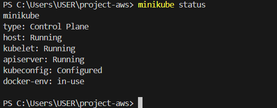
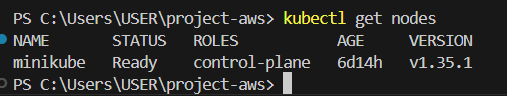
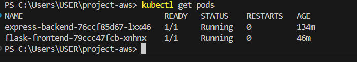
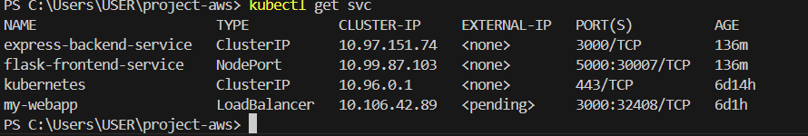
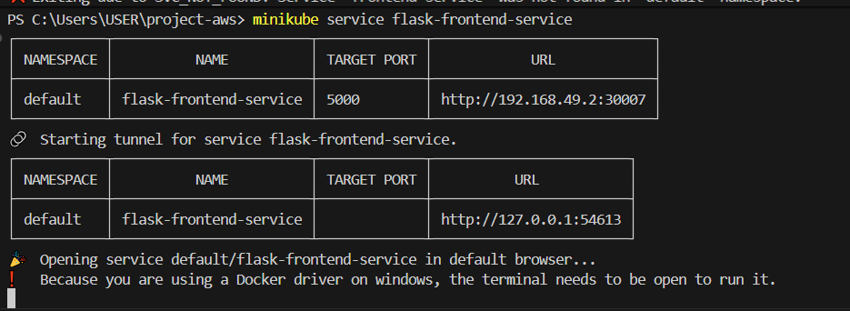
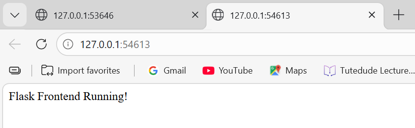

# Kubernetes Deployment (Minikube)

This repository contains the backend and frontend code deployed using Kubernetes (Minikube).

## Deployment

- **Frontend:** Accessible via `minikube service frontend-service`
- **Backend:** Runs inside Kubernetes cluster (service exposed internally)

## Screenshots

### Minikube Start

### Nodes

### Pods

### Services

### Minikube Service

### Application Output

### Frontend

### Backend

## Project Structure

- backend/
- frontend/
- k8s-manifests/
  - backend-deployment.yaml
  - frontend-deployment.yaml

## Notes

- Backend: Flask app  
- Frontend: Express app  
- Deployment: Kubernetes (Minikube)  